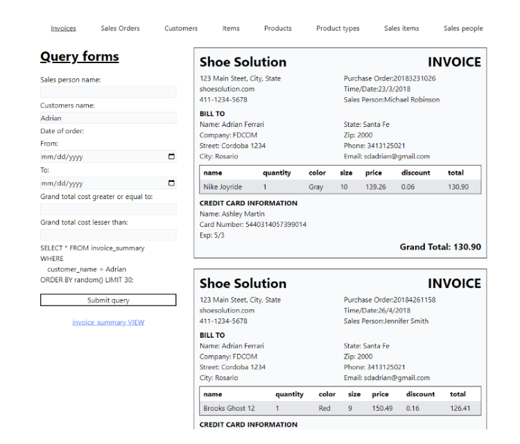

# Sales Orders

Is an app of a fictitious Shoe Shop that query the database for all its sales history using:

- Vite-Express for its front and backend.
- Postgresql for the database.
- PgAdmin for managing the database.
- Joi for validating query requests.

It's designed to be use in a single docker container.

You can filter the list adding conditions to the query on the frontend and sending them to the backend through url query parameters, the backend will query the backend and send the response to the frontend.

## Screenshot

     

